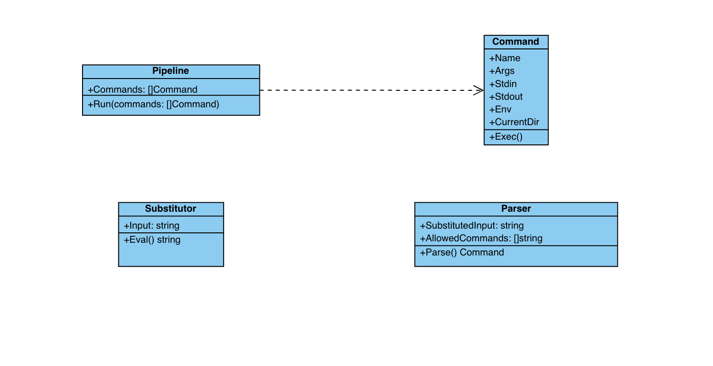

# Software design

## Проектирование интерпретатора bash

Реализовать интерпретатор предполагается на Golang.

При проектировании работы интерпретатора выделяются три подсистемы: `препроцессинга`, `парсинга` и `выполнения команды`.  

При вводе данных пользоватлем в интерпретаторе, сначала отрабатывает подсистема препроцессинга. Она выполняет все подстановки $ (внутри " или при отсутствии любых, при '' оставляет как есть) в исходных данных.  

Затем, после препроцессинга, выполняется парсинг данных. Парсинг разбирает полученные данные, чтобы получить команду (`Command`), которая имеет следующие составляющие:
- имя исполняемого файла (name)
- переданные аргументы (args, массив слов разделенных через пробел (кроме аргументов обрамленных кавычками), начиная с 1 индекса, 0 это name)
- поток стандартного ввода (stdin)
- поток стандартного вывода (stdout)
- окружение (env, которое может быть представлено в виде map[string]string, при первоначальном запуске можно унаследовать от родительского процесса)
- текущая директория (CurrentDir, при первоначальном запуске можно унаследовать от родительского процесса)

И на заверщающем этапе, после парсинга, сформированные команды исполняются в соответствующей подсистеме выполнения.  
В одной строке, вводимой в интерпретатор, может быть одна или несколько команд. Если переданы несколько команд, то они связываются через пайп `|`, где на stdin текущей команде передается stdout предыдущей.  

Ниже представлена примерная диаграмма классов:

- `Substitutor` - класс, который в поле `Input` хранит исходную строку пользователя и через метод `Eval()` выполняет подстановку переменных через `$`
- `Parser` - класс, который в поле `SubstituedInput` хранит сторку в которой разрешены все подстановки, и список поддерживаемых команд в `AllowedCommands`. Через метод `Parse()` осуществляется парсинг строки, который возвращает объект класса `Command`
- `Pipeline` - класс, который выполняет все команды из поля `Commands` (если их несколько, переданных через `|`), указанные в строке через метод `Run()`