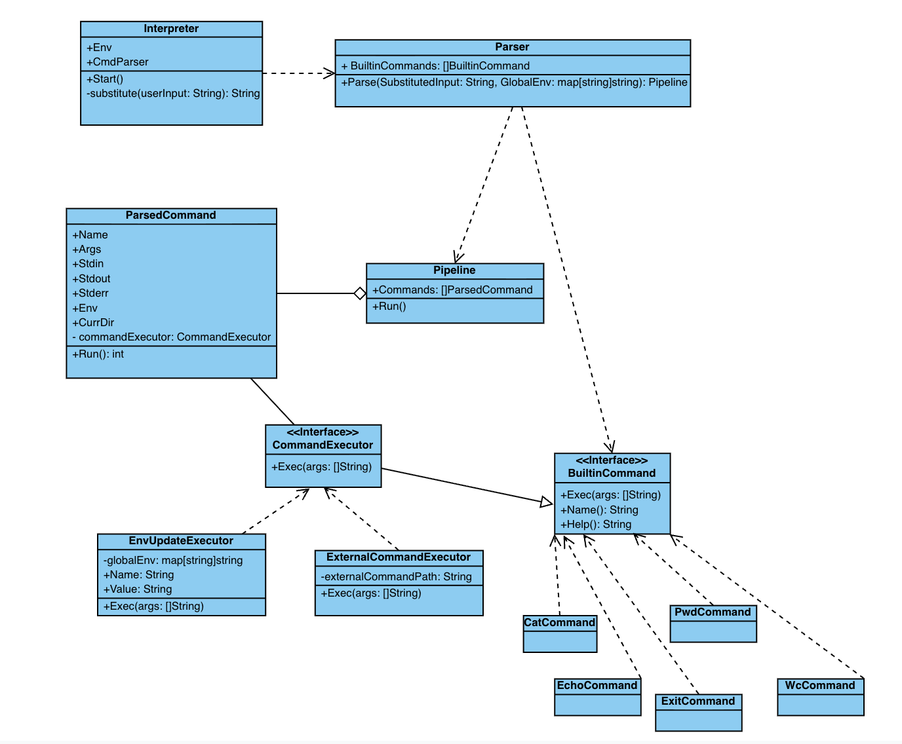

# Проектирование интерпретатора bash

Реализовать интерпретатор предполагается на Golang.

Для того чтобы запустить интерпретатор, нужно будет запустить соответствующий исполняемый файл, который получатеся после сборки приложения из исходных кодов на Golang
```bash
go build -o go-cli
./go-cli
>echo "Hello, world!"
Hello, world!
>exit
```
Соответственно, запуск собранного исполняемого файла будет **точкой входа** в интерпретатор.  
**Точкой выхода** из него будет команда `exit`, которая совершит выход из интерпретатора и завешит соответствующий процесс.  

## Обработка команд в интерпретаторе
Формат команд, которые пользователь может вводить в интерпретатор выглядит следующим образом

### Полная команда
```
[VAR1=value1 ...] command_name [arg1] ... 
```
- Перед командой опционально могут добавляться ее переменные окружения
- Затем идет название команды (`command_name`) и (при наличии) ее аргументы, разделенные пробелами
- Значение `command_name` проверяется следующим образом:  
  * Сначала проверяется наличие `command_name` во встроенных (builtin) командах, изначально поддерживается следующий список( который впоследствии можно будет расширить)  
    * `cat [FILE]` - вывод на экран содержимого файла
    * `echo [arg] ...` - вывод на экран переданных аргументов
    * `wc [FILE]` - вывод количества слов/строк/байт в файле
    * `pwd` - вывод текущей директории
    * `exit` - выход из интерпретатора
  * Если `command_name` не был найден в списке встроенных (builtin) командах, то следующим будет выполнятся поиск исполняемого файла с названием `command_name` в одной из директорий, перечисленных в переменной окружения `PATH` в формате `PATH=<dir_path1>:<dir_path_2>...:<dir_path_n>`  
    * Если исполняемый файл будет найден в одной из данных директорий, то он будет запушен с переданными аргументами в отдельном процессе (через Process или его аналоги)
  * Если `command_name` в `PATH` не будет найден, то в терминал выведется соовтветствующее сообщение об ошибке (о том что интерпретатор не смог распознать введенную команду).


### Пайплайны
Также нужно отметить, что интерпретатор поддерживает объединение нескольких команд (в вышеописанном формате) в pipeline через символ `|`:  
```
cmd_1 | cmd_2 | ... | cmd_n
```
где на stdin текущей команде передается stdout предыдущей.

### Подстановка переменных окружения
Интерпретатор поддерживает подстановку переменных окружения в двух форматах:
- `$VAR` - простая подстановка
- `${VAR}` - подстановка в фигурных скобках

```
> echo $HOME
/home/user
> echo ${PATH}
/usr/bin:/bin
> echo $USER живет в $HOME
john живет в /home/user
```

Если переменная не найдена, она остается неизменной:
```
> echo $UNDEFINED
$UNDEFINED
```

## Общая схема

При проектировании работы интерпретатора выделяются три подсистемы: `препроцессинга`, `парсинга` и `выполнения команды`.  


При вводе данных пользователем в интерпретаторе, сначала отрабатывает подсистема препроцессинга. Она выполняет все подстановки `$VAR` и `${VAR}` в пользовательском вводе.

Затем, после подстановки, выполняется парсинг данных. Парсинг разбирает полученные данные, чтобы получить команды (`ParsedCommand`), которые объединяются в `Pipeline`. Каждая команда имеет следующие составляющие:
- имя команды (Name)
- аргументы (Args, массив строк)
- контекст выполнения (Context типа `CommandContext`):
  - поток стандартного ввода (Stdin)
  - поток стандартного вывода (Stdout)
  - поток ошибок (Stderr)
  - переменные окружения (Env)
  - текущая директория (Dir)

На завершающем этапе, после парсинга, сформированные команды исполняются в подсистеме выполнения через `Pipeline.Run()`.  
В одной строке, вводимой в интерпретатор, может быть одна или несколько команд. Если переданы несколько команд, то они связываются через пайп `|`, где на stdin текущей команде передается stdout предыдущей.  

Ниже представлена примерная диаграмма классов:



- `Interpreter` - структура, которая является точкой входа в интерпретатор через метод `Start()`.  
  В данном методе обрабатываются введенные пользователем данные в интерпретатор до тех пор, пока он не введет `exit` или не будет достигнут EOF.  
  Поля:
  - `Env` - глобальные переменные окружения (map[string]string)
  - `CmdParser` - парсер команд (Parser)
  
  В цикле обработка пользовательских данных устроена следующим образом:
  1. Сначала данные обрабатываются через метод `substitute(userInput)` для подстановки всех переменных (`$VAR` и `${VAR}`), на выходе получается строка со всеми разрешенными подстановками
  2. Затем, используя объект `Parser` в поле `CmdParser`, запускается парсинг команды через `CmdParser.Parse(substitutedInput, Env)` и в результате получается объект `Pipeline`
  3. Запускается пайплайн через `pipeline.Run()` для выполнения команд
- `Parser` - структура, которая разбирает строку с подставленными переменными через метод `Parse()`.  
  Поля:
  - `BuiltinCommands` - список встроенных команд ([]BuiltinCommand)
  
  Метод `Parse(substitutedInput string, globalEnv map[string]string)` выполняет разбор переданной строки и возвращает объект `Pipeline`.  
  Процесс парсинга:
  1. Проверяет команду `exit` (возвращает `ErrExit`)
  2. Разбивает строку по символу `|` для получения отдельных команд
  3. Для каждой команды создает `ParsedCommand` с:
     - `Name` - имя команды
     - `Args` - аргументы команды
     - `Context` - контекст выполнения с переменными окружения и текущей директорией
  4. Возвращает `Pipeline` со списком команд
- `BuiltinCommand` - интерфейс для встроенных команд, расширяет `CommandExecutor`.  
  Методы:
  - `Name() string` - возвращает имя команды
  - `Help() string` - возвращает справку по команде
  - `Exec(args []string, ctx *CommandContext) error` - выполняет команду
  
  Реализации: `EchoCommand`, `PwdCommand`, `CatCommand`, `WcCommand`, `ExitCommand`

- `CommandExecutor` - базовый интерфейс для выполнения команд.  
  Методы:
  - `Exec(args []string, ctx *CommandContext) error` - выполняет команду с аргументами и контекстом

- `CommandContext` - структура, содержащая контекст выполнения команды.  
  Поля:
  - `Stdin io.Reader` - поток ввода
  - `Stdout io.Writer` - поток вывода
  - `Stderr io.Writer` - поток ошибок
  - `Env map[string]string` - переменные окружения
  - `Dir string` - текущая директория

- `Pipeline` - структура, которая выполняет последовательность команд через метод `Run()`.  
  Поля:
  - `Commands []ParsedCommand` - список команд для выполнения
  - `BuiltinCommands []BuiltinCommand` - список встроенных команд для проверки
  
  Метод `Run()` выполняет команды:
  - Для одиночной команды: настраивает stdin/stdout/stderr и выполняет
  - Для множественных команд: создает пайпы между ними, настраивает потоки и выполняет последовательно

- `ParsedCommand` - структура, представляющая разобранную команду.  
  Поля:
  - `Name string` - имя команды
  - `Args []string` - аргументы команды
  - `Context *CommandContext` - контекст выполнения
  
  Метод `Run(builtinCommands []BuiltinCommand) int`:
  1. Сначала проверяет, является ли команда встроенной (builtin)
  2. Если нет - пытается выполнить как внешнюю программу через `exec.Command`
  3. Возвращает код возврата: 0 для успеха, 1 для ошибки

## Структура пакетов

Проект организован следующим образом:

```
cmd/go-cli/
├── main.go          - Точка входа, инициализация Interpreter

internal/
├── interpreter/     - REPL и подстановка переменных
│   └── interpreter.go
├── parser/          - Парсинг команд и пайпов
│   └── parser.go
├── exec/            - Выполнение команд и пайплайнов
│   └── exec.go
├── commands/        - Встроенные команды
│   ├── commands.go  - Интерфейсы и CommandContext
│   ├── echo.go
│   ├── pwd.go
│   ├── cat.go
│   ├── wc.go
│   └── exit.go
└── errors/          - Пользовательские ошибки
    └── errors.go
```

### Зависимости между пакетами

```
main
 └─> interpreter
      ├─> parser
      │    ├─> exec
      │    ├─> commands
      │    └─> errors
      └─> commands

exec
 └─> commands

commands (базовый пакет, нет зависимостей кроме stdlib)
```
