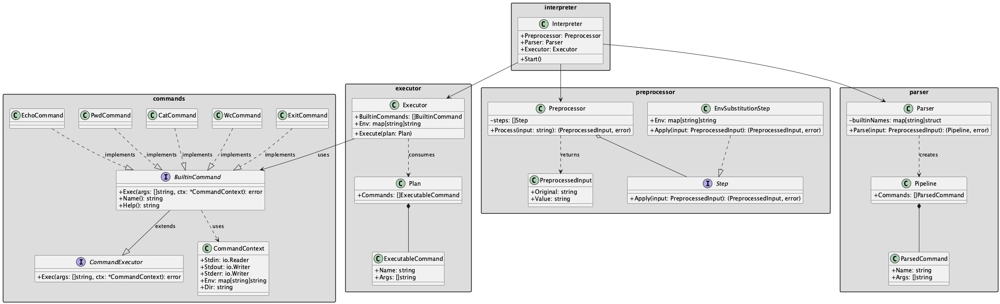

# Проектирование интерпретатора bash

Реализовать интерпретатор предполагается на Golang.

Для того чтобы запустить интерпретатор, нужно будет запустить соответствующий исполняемый файл, который получается после сборки приложения из исходных кодов на Golang
```bash
go build -o go-cli
./go-cli
>echo "Hello, world!"
Hello, world!
>exit
```
Соответственно, запуск собранного исполняемого файла будет **точкой входа** в интерпретатор.  
**Точкой выхода** из него будет команда `exit`, которая совершит выход из интерпретатора и завешит соответствующий процесс.  

## Обработка команд в интерпретаторе
Формат команд, которые пользователь может вводить в интерпретатор выглядит следующим образом

### Полная команда
```
[VAR1=value1 ...] command_name [arg1] ... 
```
- Перед командой опционально могут добавляться ее переменные окружения
- Затем идет название команды (`command_name`) и (при наличии) ее аргументы, разделенные пробелами
- Значение `command_name` проверяется следующим образом:  
  * Сначала проверяется наличие `command_name` во встроенных (builtin) командах, изначально поддерживается следующий список( который впоследствии можно будет расширить)  
    * `cat [FILE]` - вывод на экран содержимого файла
    * `echo [arg] ...` - вывод на экран переданных аргументов
    * `grep [OPTIONS] PATTERN [FILE]` - поиск строк по регулярному выражению
    * `wc [FILE]` - вывод количества слов/строк/байт в файле
    * `pwd` - вывод текущей директории
    * `exit` - выход из интерпретатора
  * Если `command_name` не был найден в списке встроенных (builtin) командах, то следующим будет выполнятся поиск исполняемого файла с названием `command_name` в одной из директорий, перечисленных в переменной окружения `PATH` в формате `PATH=<dir_path1>:<dir_path_2>...:<dir_path_n>`  
    * Если исполняемый файл будет найден в одной из данных директорий, то он будет запушен с переданными аргументами в отдельном процессе (через Process или его аналоги)
  * Если `command_name` в `PATH` не будет найден, то в терминал выведется соовтветствующее сообщение об ошибке (о том что интерпретатор не смог распознать введенную команду).


### Пайплайны
Также нужно отметить, что интерпретатор поддерживает объединение нескольких команд (в вышеописанном формате) в pipeline через символ `|`:  
```
cmd_1 | cmd_2 | ... | cmd_n
```
где на stdin текущей команде передается stdout предыдущей.

### Подстановка переменных окружения
Интерпретатор поддерживает подстановку переменных окружения в двух форматах:
- `$VAR` - простая подстановка
- `${VAR}` - подстановка в фигурных скобках

```
> echo $HOME
/home/user
> echo ${PATH}
/usr/bin:/bin
> echo $USER живет в $HOME
john живет в /home/user
```

Если переменная не найдена, она остается неизменной:
```
> echo $UNDEFINED
$UNDEFINED
```

## Общая схема

При проектировании работы интерпретатора выделяются три независимых подсистемы: `препроцессинга`, `парсинга` и `выполнения команды`.  


### Препроцессинг
Первая подсистема использует **Template Method** и **Strategy** паттерны. Принимает строку ввода и прогоняет её через последовательность шагов. Каждый шаг реализует интерфейс `Step` и получает на вход объект `Result`, содержащий исходную и текущее значение строки. Метод `Process()` определяет общий алгоритм обработки, но делегирует конкретные преобразования объектам `Step`. На данный момент реализован шаг `EnvSubstitutionStep`, который отвечает за подстановку переменных окружения `$VAR` и `${VAR}`. Архитектура позволяет добавлять новые шаги (например, экранирование, нормализацию пробелов и т.д.), не затрагивая остальной код.

### Парсинг
Второй слой использует **Builder** паттерн для построения модели данных. Получает `preprocessor.PreprocessedInput` и строит собственную модель `Pipeline`, состоящую из набора `ParsedCommand { Name, Args }`. Парсер ничего не знает о переменных окружения или потоках ввода/вывода, он лишь проверяет корректность команд (builtin / внешняя / присваивание) и возвращает чистую структуру данных. Использует утилиты из пакета `checkutils` для валидации команд.

### Выполнение
Третий слой использует **Command** паттерн. Принимает `executor.Plan`, который состоит из `ExecutableCommand` (инкапсулирует запрос на выполнение команды). План формируется интерпретатором на основе данных парсера. `Executor` отвечает за:
- создание `CommandContext` для каждой команды (stdin, stdout, stderr, env, dir);
- настройку пайпов между командами;
- вызов встроенных команд (через интерфейс `BuiltinCommand`) или запуск внешних процессов;
- обработку присваиваний переменных окружения.

В одной строке может быть одна или несколько команд. Если переданы несколько команд, то они связываются через пайп `|`, где на stdin текущей команде передается stdout предыдущей.  

Ниже представлена актуальная диаграмма классов:



- `Interpreter` — реализует **Facade (Фасад)** паттерн. Координирует работу всех подсистем, предоставляя упрощенный интерфейс для клиентского кода. Поля:
  - `Preprocessor` — экземпляр `preprocessor.Preprocessor`
  - `Parser` — экземпляр `parser.Parser`
  - `Executor` — экземпляр `executor.Executor`
  
  Алгоритм `Start()`:
  1. Считать ввод пользователя.
  2. Передать строку в `Preprocessor.Process`.
  3. Результат отдать `Parser.Parse`, получить `parser.Pipeline`.
  4. Преобразовать его в `executor.Plan` и вызвать `Executor.Execute`.

- `Preprocessor` — использует **Template Method** и **Strategy** паттерны. Принимает строку ввода, прогоняет через последовательность шагов (`Step`). Каждый шаг реализует интерфейс `Step`. Метод `Process()` определяет алгоритм обработки, но делегирует конкретные преобразования объектам `Step`.

- `Parser` — использует **Builder** паттерн для построения модели данных. Принимает `preprocessor.PreprocessedInput`, возвращает `parser.Pipeline`. Конфигурируется списком имен builtin-команд. Не зависит от пакета `commands` или `executor`. Использует утилиты из `checkutils` для валидации команд.

- `Executor` — реализует **Command** паттерн. Принимает `Plan` с набором `ExecutableCommand` (инкапсулирует запросы на выполнение). Отвечает за создание контекстов выполнения, настройку пайпов и запуск команд.

- `BuiltinCommand` — интерфейс для встроенных команд, реализует **Strategy** паттерн. Расширяет `CommandExecutor`.  
  Методы:
  - `Name() string` - возвращает имя команды
  - `Help() string` - возвращает справку по команде
  - `Exec(args []string, ctx *CommandContext) error` - выполняет команду
  
  Реализации: `EchoCommand`, `PwdCommand`, `CatCommand`, `WcCommand`, `GrepCommand`, `ExitCommand`

- `CommandExecutor` — базовый интерфейс для выполнения команд. Определяет контракт для всех команд.  
  Методы:
  - `Exec(args []string, ctx *CommandContext) error` - выполняет команду с аргументами и контекстом

- `CommandContext` — реализует **Context Object** паттерн. Содержит контекст выполнения команды. Упаковывает все необходимые параметры (потоки ввода/вывода, переменные окружения, директорию) в один объект.  
  Поля:
  - `Stdin io.Reader` - поток ввода
  - `Stdout io.Writer` - поток вывода
  - `Stderr io.Writer` - поток ошибок
  - `Env map[string]string` - переменные окружения
  - `Dir string` - текущая директория

- `Pipeline` (в пакете `parser`) — структура данных, представляющая последовательность команд.  
  Поля:
  - `Commands []ParsedCommand` - список разобранных команд
  
  Не содержит логики выполнения, только данные.

- `Plan` (в пакете `executor`) — структура, представляющая план выполнения команд.  
  Поля:
  - `Commands []ExecutableCommand` - список команд для выполнения

- `ParsedCommand` (в пакете `parser`) - структура данных, представляющая разобранную команду.  
  Поля:
  - `Name string` - имя команды
  - `Args []string` - аргументы команды

- `GrepCommand` — встроенная команда для поиска строк по регулярному выражению.  
  Реализует интерфейс `BuiltinCommand`. Использует стандартную библиотеку `flag` для разбора аргументов.
  
  Поддерживаемые флаги:
  - `-i` — регистронезависимый поиск (case-insensitive)
  - `-w` — поиск только слова целиком (word match)
  - `-A N` — печатать N строк после каждого совпадения
  
  Вспомогательные структуры и функции:
  - `grepFlags` — структура для хранения распарсенных флагов
  - `parseGrepFlags()` — разбор аргументов командной строки
  - `buildRegexp()` — построение регулярного выражения с учётом флагов
  - `grepReader()` — выполнение поиска в потоке данных
  - `lineMatches()` — проверка соответствия строки паттерну
  - `matchesWord()` — проверка, что совпадение — слово целиком
  - `isWordChar()` — проверка, является ли символ частью слова (Unicode-aware)

### Выбор библиотеки для разбора аргументов

Для команды `grep` требуется нетривиальный разбор аргументов командной строки. 
Рассматривались следующие библиотеки:

| Библиотека | Описание |
|------------|----------|
| **flag** (стандартная) | Стандартная библиотека Go |
| **pflag** (spf13/pflag) | POSIX-совместимый парсер |
| **cobra** (spf13/cobra) | Полноценный CLI-фреймворк |
| **kong** (alecthomas/kong) | Декларативный парсер |

**Выбор:** стандартная библиотека `flag`

**Обоснование:**
1. Нет внешних зависимостей
2. Поддерживает все необходимые типы флагов
3. FlagSet позволяет изолировать парсинг для каждой команды
4. Хорошо документирована и стабильна

## Структура пакетов

Проект организован следующим образом:

```
cmd/go-cli/
└── main.go          - Точка входа, инициализация Interpreter

internal/
├── interpreter/     - Facade для координации всех подсистем (REPL)
│   ├── interpreter.go
│   └── interpreter_test.go
├── preprocessor/    - Препроцессинг ввода (Template Method + Strategy)
│   ├── preprocessor.go
│   └── preprocessor_test.go
├── parser/          - Парсинг команд и пайпов (Builder)
│   ├── parser.go
│   └── parser_test.go
├── executor/        - Выполнение команд (Command pattern)
│   ├── executor.go
│   └── executor_test.go
├── commands/        - Встроенные команды (Strategy)
│   ├── commands.go  - Интерфейсы и CommandContext
│   ├── echo.go
│   ├── pwd.go
│   ├── cat.go
│   ├── wc.go
│   ├── grep.go      - Команда grep с поддержкой -i, -w, -A
│   ├── exit.go
│   └── *_test.go    - Тесты команд
├── checkutils/      - Утилиты для проверки команд
│   ├── check_command.go
│   └── check_command_test.go
└── errors/          - Пользовательские ошибки
    ├── errors.go
    └── errors_test.go
```