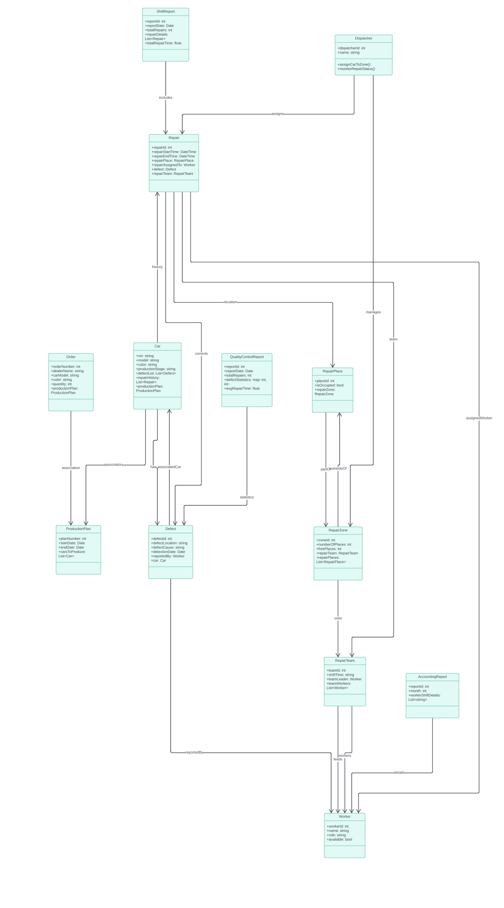

## Анализ недостатков диаграммы классов

- У класса `Dispatcher` методы `assignCarToZone()`, `monitorRepairStatus()` не имеют параметров
- Нет смысла выносить `totalRepairTime` и `totalRepairs` в классе `ShiftRepair`, так как эти данные уже содержатся в поле `RepairDetails`
- Нет смысла выносить `numberOfPlaces` и `freePlaces` в классе `RepirZone`, так как эти данные уже содержатся в поле `repairPlaces`
- Не конкретизированы связи между классами `Order` <-> `ProductionPlan` и `Car` <-> `ProductionPlan`
- Классы `QualityControlReport`, `ShiftReport`, `AccountingReport` имеют дублирующие поля (id, дата), которые можно было бы вынести в общий базовый класс Report
- В классе `QualityControlReport` непонятно как считается `defectStatistics` представляемый через `map<int, int>`, вероятно эту статистику стоит вынести в отдельный класс и хранить ее в соответствующем объекте, из которого также можно будет получить данные которые содержатся в полях `totalRepairs` и `avgRepairTime`

