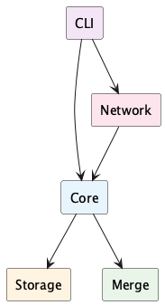
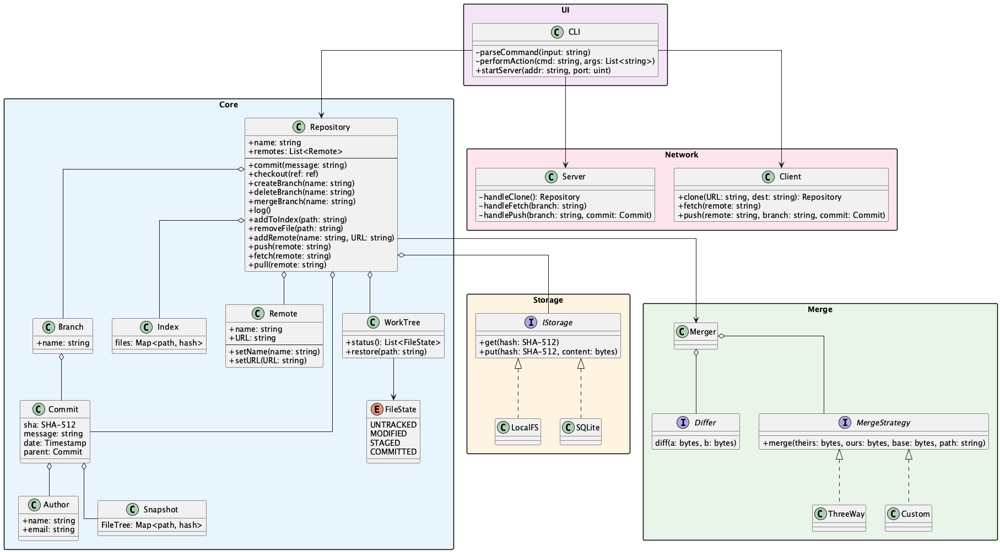

# VCS — Система контроля версий

## Диаграмма компонентов

**Компоненты:**
- **CLI** — консольный интерфейс, парсинг команд, запуск сервера
- **Core** — ядро: Repository, Commit, Branch, Index, WorkTree
- **Storage** — абстракция хранилища (LocalFS, SQLite)
- **Merge** — слияние веток с разрешением конфликтов (ThreeWay, Custom)
- **Network** — Client/Server для работы с удалёнными репозиториями

## Диаграмма классов

### Core
- **Repository** — основной класс: commit, checkout, branch, merge, push/pull
- **Commit** — ревизия с SHA-512, message, date, parent
- **Branch** — ветка, указывает на Commit
- **Index** — staging area (staged файлы)
- **WorkTree** — рабочая директория, отслеживает состояния файлов
- **FileState** — UNTRACKED → MODIFIED → STAGED → COMMITTED
- **Snapshot** — дерево файлов коммита
- **Author** — автор коммита
- **Remote** — удалённый репозиторий

### Storage
- **IStorage** — интерфейс хранилища (get/put по хешу)
- **LocalFS**, **SQLite** — реализации

### Merge
- **Merger** — движок слияния
- **Differ** — вычисление diff
- **MergeStrategy** — стратегия слияния (ThreeWay, Custom)

### Network
- **Server** — обработка clone/fetch/push
- **Client** — клиент для работы с remote

### UI
- **CLI** — консольный интерфейс
